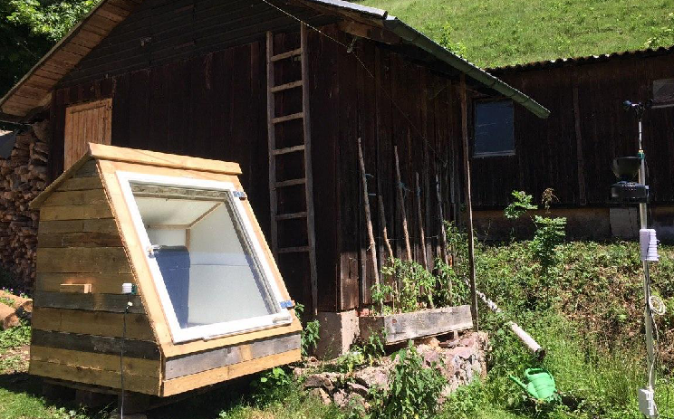
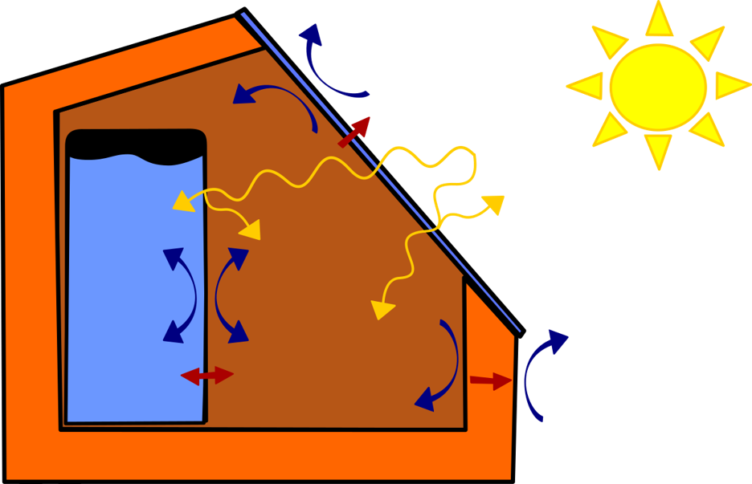
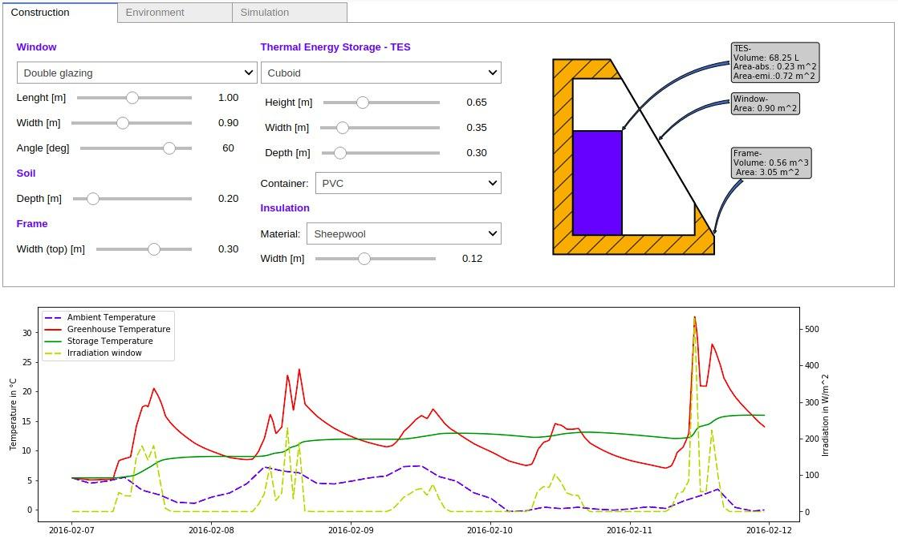

# Abstract
A greenhouse is build based on calculations regarding the thermal processes in a Jupyter notebook (Python) to provide a configuration tool for used materials and dimensions. Temperature and irradiance data measured over a period of three weeks is compared to the calculated values. The resulting plots of measured vs. calculated temperatures show similar behaviour, but deviations in the greenhouse temperature peaks, e.g. due to constructive differences and simplified thermal processes. The improved configurator is published as an open source tool and the greenhouse is built with sustainable components.

 

# Motivation & Goals

* Extended growing period for vegetable plants in Germany
* Low budget components
* Low impact materials
* Solar energy driven
* Configurator tool for easy reconstruction based on a thermal model

# Thermal Model

 
Fig.: Heat transfer mechanisms
 
Fig.: Thermal Network

# Interactive jupyter notebook

 
Fig.: Flow Chart

 
Fig.: User Interface of the configurator

# Evaluation & Conclusion
 
Fig.: Measured data vs. calculated values

Deviations between model and measurement due to
* Constructive differences (e.g. geometry, material parameters)
* Neglected / uncertain thermal processes (e.g. thermal mass of construction material, ventilation number)
* Approximated irradiance measurement  

Achievement 
* Solar greenhouse with sustainable component acquisition
* Interactive configurator tool ( Jupyter Python notebook) available on:
https://github.com/Taubenstrohhalm/SolarThermalColdframe

